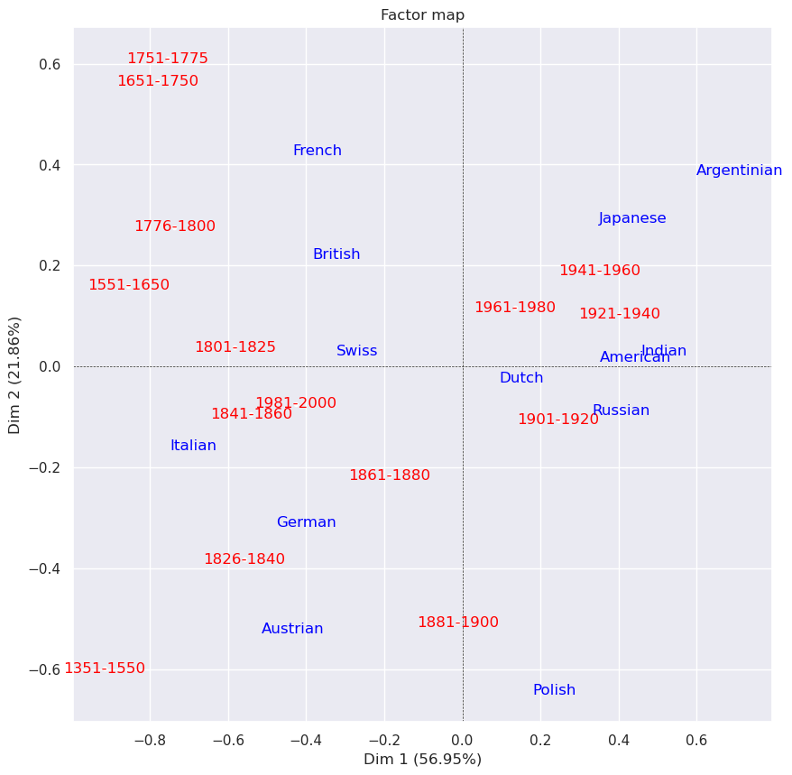

# Analysis of the generations and nationalities of the DBpedia astronomers

## Query DBpedia and store the result as a table in DBpedia

Execute this query on the [DBpedia SPARQL-Endpoint](https://dbpedia.org/sparql) and export the result as a CSV (not TSV!)

    PREFIX dbr: <http://dbpedia.org/resource/>
    PREFIX dbp: <http://dbpedia.org/property/>
    PREFIX dbo: <http://dbpedia.org/ontology/>
    PREFIX rdfs:<http://www.w3.org/2000/01/rdf-schema#>
    SELECT DISTINCT (?o1 AS ?subject_uri) ?birthYear ?country ?nationality
    WHERE {
    SELECT DISTINCT ?o1 ?birthYear ?country ?nationality
    WHERE { 
        {
            {dbr:List_of_astronomers ?p ?o1.}
        UNION
            {dbr:List_of_astrologers ?p ?o1.}
        UNION
            {?o1 ?p dbr:Astrologer.}
        UNION
            {?o1 ?p dbr:Astronomer.}
        UNION
            {?o1 ?p dbr:Mathematician.}
        }
        ?o1 a dbo:Person;
        dbp:birthDate | dbo:birthDate ?birthDate.
    OPTIONAL {
    ?o1 dbo:birthPlace ?birthPlace.
    ?birthPlace a dbo:Country.
    }
    BIND(STRAFTER(STR(?birthPlace), 'http://dbpedia.org/resource/') as ?country)
    OPTIONAL {
    ?o1 dbo:nationality|dbp:nationality ?mixedNationality.
    }
    BIND(IF(
        STRSTARTS(STR(?mixedNationality), 'http://dbpedia.org/resource/'), 
        STRAFTER(STR(?mixedNationality), 'http://dbpedia.org/resource/'), 
        STR(?mixedNationality)
    ) as ?nationality)
    BIND(xsd:integer(SUBSTR(STR(?birthDate), 1, 4)) AS ?birthYear)
        FILTER ( (?birthYear >= 1351   )) 
            }
    ORDER BY ?birthYear
    }

* Create a new table in the database using DBeaver using the CSV with the DBpedia data
* Update the 'Astronomers' GitHub repository in your noto.epfl space using GIT in JuypterLab 

## Explore the dates of births and generations of astronomers

* Open, read and execute the notebook [dbp_annees_de_naissance_exploration](https://github.com/Sciences-historiques-numeriques/astronomers/blob/main/notebooks_jupyter/dbpedia_exploration/dbp_annees_de_naissance_exploration.ipynb)

### Distribution of astronomers' births by 25-year period

#### Using the Matplotlib library

#### Using the Plotly library

For this library see also the interactive HTML export (cannot be embedded/opened in GigHub)

 ## Explore the evolution and distribution of nationalities over time

 * Add a table 'code_nationality_country' to the database and code the nationalities in relation to countries (at least for the most frequent ones)
 * Open, read and execute the notebook [dpb_countries_births](https://github.com/Sciences-historiques-numeriques/astronomers/blob/main/notebooks_jupyter/dbpedia_exploration/dpb_countries_births.ipynb)

### Distribution of astronomer's births grouped by nationalities over time

Distributions of persons per nationality and density diagram (violin-plot) showing the distribution over time.

### Distribution grouped by 15 time spans 

### Correspondence Analysis

